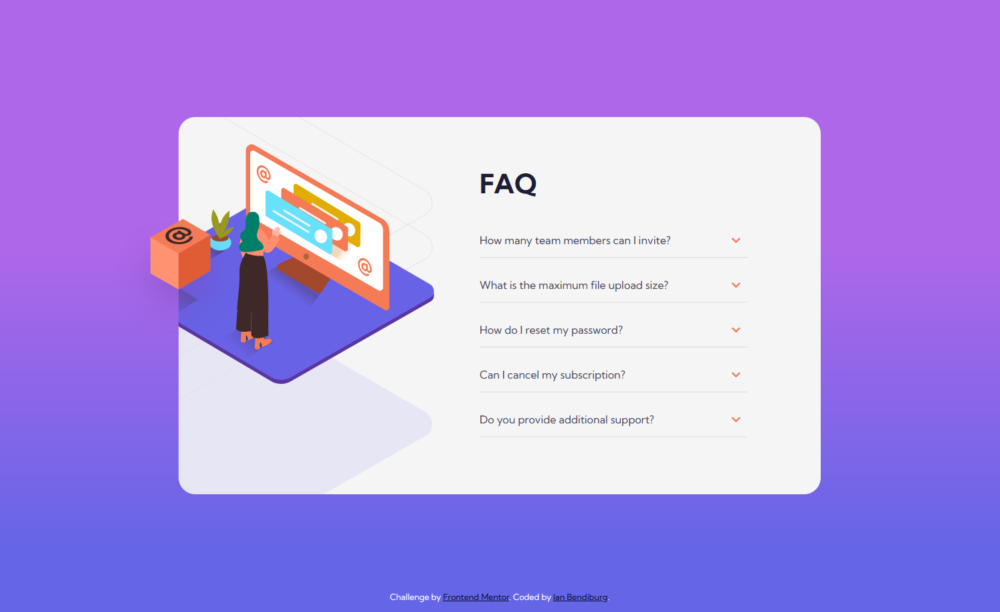
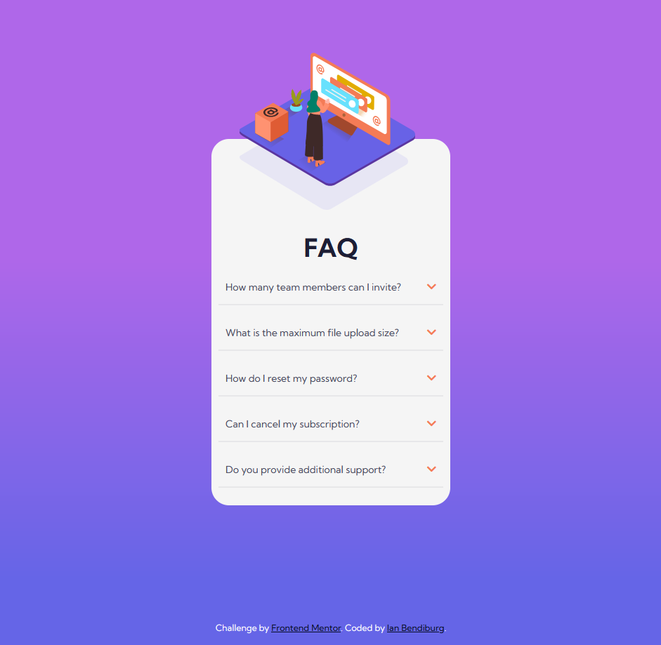

# Frontend Mentor - FAQ accordion card solution

This is a solution to the [FAQ accordion card challenge on Frontend Mentor](https://www.frontendmentor.io/challenges/faq-accordion-card-XlyjD0Oam). The objective of this challenge is to practice semantic JavaScript, HTML and CSS in order to create a card with accordion functionality.

## Table of contents

- [Overview](#overview)
  - [The challenge](#the-challenge)
  - [Screenshot](#screenshot)
  - [Links](#links)
- [My process](#my-process)
  - [Built with](#built-with)
  - [What I learned](#what-i-learned)
  - [Continued development](#continued-development)
- [Author](#author)


## Overview

### The challenge

Users should be able to:

- View the optimal layout for the component depending on their device's screen size.
- See hover states for all interactive elements on the page.
- Hide/Show the answer to a question when the question is clicked.
- Practice Absolute positioning as in order to place the images positioning.

### Screenshot


- Desktop Design 1440p.


- Mobile Design 370p.


### Links

- Github URL: [Add solution URL here](https://github.com/ibendiburg/5-faq-accordion-card-main)
- Live Demo URL: [Add live site URL here](https://5-faq-accordion-card-main.vercel.app/)

## My process

### Built with

- Semantic HTML5 markup
- CSS custom properties
- Flexbox
- Mobile-first workflow
- Semantic JavaScript


### What I learned

The main purpose of this challenge project is to practice my semantic JavaScript in order to build an accordion component. How to use query selectors as well as Select elements by Id.

The first step for the javaScript was to select all of the questions of the accordion using querySelectorAll
```js
var answers = document.querySelectorAll(".answer");
```
Once we have selected all of the questions we are gonna create an event listener for click for each of the questions. and then on click event we are gonna toggle the class active on both the question element and answer element.
```js
//Creates eventListener for each Question on HTML Doc. 
questions.forEach(question => {
    question.addEventListener("click", event => {
        //Toggles the active class on Question element and answer element
        question.classList.toggle("active");
        question.nextElementSibling.classList.toggle("active");
    })
})
```
The answer element contains the following CSS:
```css
.answer{
    /*display: none makes it so the answer in accordion doesnt show*/
    display: none;
    font-size: 12px;
    font-weight: 400;
    max-width: 310px;
    color: var(--Dark-grayish-blue);
    padding-top: 5px;
    padding-bottom: 5px;
    margin-bottom: 5px;
    opacity: 0;

    transition: all 0.3s ease;
}
```
Finally by toggling the class active the following css code is added:
```css
.answer.active{
    padding-top: 5px;
    padding-bottom: 5px;
    /*changes display to inline-block making it visible on click*/
    display: inline-block;
    opacity: 1;
}
```

### Continued development

For further development I would like to figure out how to create or animate a transition between both states so that once its active there is a transition animation.


## Author

- Frontend Mentor - [@yourusername](https://www.frontendmentor.io/profile/ibendiburg)

